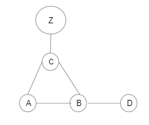
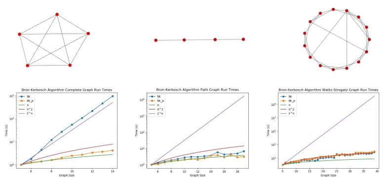

# Maximal Clique Finding
## MTH2110 Final Project
*Jack Mao, Sander Miller, Jonathan Zerez*

*Fall, 2020*

This is our final project for MTH2110, Discrete Mathematics at Olin College. We created a presentation for this project which can be found [here](https://docs.google.com/presentation/d/1jI3wRa_uOKRw0KP5yKQwU8e_3OllZ8jxJtRAo30QSPc/edit?usp=sharing).

## Introduction
Cliques are fully connected subgraphs of a larger graph. If you imagine a social network, if there is a friend-group where each person within the group is friends with every other person in the group, then that friend-group would be called a clique. A clique is considered to be maximal if no additional nodes can be added to the subgraph while keeping the subgraph a clique.

Finding cliques and maximal cliques has a lot of real world applications, for example, in chemistry, it is used to predict the folding structure of proteins. Additionally, it is  generally a really interesting problem to solve.

In our project, we focused on implementing a number of different techniques to find the maximal cliques within a given graph G. We started off with a brute force algorithm that processes each and every possible unique subgraph and checks whether or not it is a maximal clique. From there, we implemented a few different versions of the Bron-Kerbosch algorithm, a recursive backtracking algorithm that is able to find the maximal cliques of a graph much more efficiently than a brute force method.

## Explanation of Bron Kerbosh Algorithm
The Bron-Kerbosch algorithm is a recursive backtracking algorithm that is able to return the maximal cliques of a graph `G`. This section will detail how the algorithm works and more importantly, why it works.

We begin by defining three sets of nodes, `R`, `P` and `X`. These sets are defined to be completely disjoint from each other, meaning that an element found in one set must not also be found in any of the other sets, and will contain various nodes of the graph `G`.

* `R` is defined as the set that contains nodes that are **certainly** contained within the current maximal clique that is being considered
* `P` is defined as the set that contains nodes that **might** be contained within the current maximal clique that is being considered
* `X` is defined as the set that contains nodes that are **definitely not** contained within the current maximal clique that is being considered

The pseudocode for the algorithm looks something like this, where `N(n)` returns the set of nodes that are neighbors of node `n`:
```
Bron_Kerbosch(R, P, X):
  if P is empty AND X is empty:
    return R as a maximal clique

  for each node n in P:
    Bron_Kerbosch(R + n, P ∩ N(n), X ∩ N(n))
    P = P - n
    X = X + n
```

At the highest level, this pseudocode is essentially saying, "*for each node in a graph `G`, find a maximal clique that contains that node*". We will now explain why that is the case in more detail.

For the sake of convenience, we will consider graph `G` to be the graph below. There may be nodes other than `a`, `b`, `c`, and `d`, but we will only iterate over these nodes for the sake of simplicity. We will suppose that there is a fully connected subgraph `Z` within `G` where each node in `Z` is connected to `c`. We will call the set of all nodes `Q`



When the function is first called, `R` and `X` are empty since we have not explored any nodes and therefore cannot definitively say whether any particular node is or is not in the maximal clique. Therefore `P` is set equal to `Q` as we are unsure about all of the nodes included in the current maximal clique. We set `n = a`, as `a` is the first element of `P`. Supposing that this node is part of a maximal clique, we will call the algorithm again, but this time, `a` will be a member of `R`. Because the nodes in a clique must be connected to every other node in a clique, the new set of possible clique nodes, `P`, is set to the intersection between `P` and the neighbors of `a`, `N(a)`. By the definition of a clique, all member nodes must be neighbors of every other node, therefore all possible clique members must be a neighbor of `a`. We find the intersection between `X` and `N(a)` for similar reasons: `X` only needs to keep track of nodes that are definitely not in the clique or nodes that have already shared a maximal clique with the current node.

So when we call `Bron_Kerbosch` for the second time, dropping down to recursion depth 2, we find that `R = {a}`, `P = Q  ∩ N(a) = N(a) = {b,c}`, and `X = {}`. Now our goal is to find the maximal cliques of the graph that certainly contain `a` and could potentially contain `b` and `c`. We iterate through the nodes of `P` again, this time,  `n = b`. We call the function yet again.

In the third call to the function at recursion depth 3, `R = {a,b}`, `P = {c}` and `X = {}`. Now our goal is to find the maximal cliques of the graph that certainly contain `a` and `b`, and could potentially contain `c`. We iterate through the nodes of `P` again, this time, `n = c`. We finally call the function again.

In this fourth call to the function at recursion depth 4, `R = {a,b,c}`, `P = {}` and `X = {}`. When the function is called again, we find that both `P` and `X` are empty, so `R = {a,b,c}` is returned as a maximal clique. Checking with the graph visually, we find that this is indeed a maximal clique of the graph!

To see the steps to recurse back up the graph, see [Appendix A](#Appendix-A).

Once the program has recursed back to the first call of the algorithm, we find that `R = {}`, `P = {b,c,d,z}` and `X = {a}`. The algorithm will run again, this time starting with `n = b` to find a maximal clique that contains `b`, but does not contain `a`. This happens to be the set `{b,d}`. This demonstrates why nodes `b` and `c` cannot immediately be added to `X`, despite being members of the first maximal clique found, `{a,b,c}`

Once the program recurses back to the first call of the algorithm again after finding a maximal clique that contains `b`, but not `a`, we find that `R = {}`, `P = {c,d,z}` and `X = {a,b}`. The algorithm will run again, this time starting with `n = c` to find the maximal clique that contains `c`, but does not contain `b` or `a`. This happens to be the set `{c,z}`, again, demonstrating that nodes can only be added to `X` one at a time. To assign all nodes from a found maximal clique to `X` would risk missing the opportunity to identify additional maximal cliques.

For a full visual demonstration of the recursive steps that the BK algorithm takes, see [Appendix B](#Appendix-B).

Our python implementation of the Bron-Kerbosh Algorithm can be found below. Full code can be found in `bk.py`
```python
def bk(g,r,p,x, depth=0):
    """
    Bron-Kerbosch algorithm without pivots
    g: an nx graph
    r: disjoint set of vertices of graph g
    p: disjoint set of vertices of graph g
    x: disjoint set of vertices of graph g
    """
    # if p and x are empty:
    if not p and not x:
        print('Maximal Clique found: ', r)

    while p:
        # choose and remove a node from p
        node = p.pop()
        neighbors = list(g.neighbors(node))
        bk(g, r.union([node]), p.intersection(neighbors), x.intersection(neighbors), depth=depth+1)
        x = x.union([node])
```

<!--   -->

## Explanation of Bron Kerbosch with pivoting
In the previous algorithm, we essentially iterated through all of the nodes in g given graph `G`. Although this will definitively give you all of the maximal cliques in `G`, the implementation repeats itself by checking for nodes that we know to have been in a maximal clique. To optimize our algorithm, we introduce an idea called a pivot. Given the same starting conditions in the previous implementation of Bron_Kerbosch algorithm, we define a pivot as an arbitrary node chosen from the union of the sets `P` and `X`, which we call `PUX`. In our implementation, we simply chose the first element in `PUX`, which we designate as `u`.

The new algorithm starts off the same way as the previous algorithm by checking if `P` and `X` are both empty. If this is true, then we return `R` as a maximal clique. If this is not true, we carry on with our algorithm by assigning our pivot. Then, we iterate through every node in `P - N(u)`. Let's call the first node in this iteration `v`. We recursively call the algorithm, except we set `R` to `R` union `v`, `P` to `P` intersection `N(v)`, and `X` to `X` intersection `N(v)`. After the recursion, we remove `v` from `P` and add it to `X`. Pseudocode of the algorithm is provided below.   

```
Bron_Kerbosch(R, P, X):
  if P is empty AND X is empty:
    return R as a maximal clique
  PUX = P union X
  pivot = P[0]
  for each node n in P - N(pivot):
    Bron_Kerbosch(R + n, P ∩ N(n), X ∩ N(n))
    P = P - n
    X = X + n
```

At the highest level, this pseudocode is essentially saying, "*for each node in a graph `G` that is not the neighbor of the pivot, find a maximal clique that contains that node*".


For a graph with many non-maximal cliques, for instance, a sufficiently large complete graph, the algorithm with pivots performs much better. This is due to the fact that every time we call the algorithm, we do not iterate through the neighbors of our pivot. This is efficient because we know that given the maximal clique of the pivot, the nodes in `N(pivot)` cannot form a maximal clique with each other because we know that they are all connect to the pivot. In a thought experiment, we can try to understand which maximal cliques `N(pivot)` are allowed to exist in. First, nodes in the `N(pivot)` can form some number of maximal cliques with the `pivot` due to the definition of cliques. Next, we know that `P-N(pivot)-pivot` can also form some number of maximal cliques with `N(pivot)` because these cliques do not include the `pivot` and are thus unique. Lastly, the only nodes we have left are in the `N(pivot)`. We know that the maximal cliques they form cannot include nodes from `pivot` or `P-N(pivot)-pivot` because we have already found them and have placed them in the `X`. Hypothetically, if there was a clique in `N(pivot)`, we know a larger clique exists because we can just tag on `pivot` to it by the definition of `N(pivot)`. Thus, we do not have to iterate to the nodes in `N(pivot)`.

Our python implementation of the Bron-Kerbosh Algorithm with pivoting can be found below. Full code can be found in `bk.py`
```python
def bk_p2(g,r,p,x, counter=0):
      """
      Bron-Kerbosch algorithm without pivots (implemented with python sets)
      g: an nx graph
      r: disjoint set of vertices of graph g
      p: disjoint set of vertices of graph g
      x: disjoint set of vertices of graph g
      """
      pux = p.union(x)
      if not pux:
          print('Maximal clique found: ', r)

      # choose an pivot from pux
      pivot = next(iter(pux))
      neighborsP = list(g.neighbors(pivot))
      for v in p.difference(neighborsP):
          neighborsV = list(g.neighbors(v))
          bk_p(g, r.union([v]), p.intersection(neighborsV), x.intersection(neighborsV), counter+1)
          p.remove(v)
          x.add(v)
```

### Bron-Kerbosch with Vertex Ordering
During our time researching this topic, we came across a variation of Bron-Kerbosh algorithm called Bron-Kerbosch with vertex ordering. We did not have time to look deeply or implement it. However, after thoroughly understanding the Bron-Kerbosch algorithm, we have a good idea of what it should be. Based on the ideas of Bron-Kerbosch with pivoting, we know that we can reduce the runtime greatly by picking a pivot. We can take this a step further by choosing the vertex with the biggest degree instead of choosing arbitrarily. Doing this will ensure that the number of nodes we iterate through will be further reduced. In our hypothesis, this algorithm will run faster on average for graphs with many sufficiently large maximal cliques than Bron-Kerbosch with pivoting, especially for graphs with few large maximal cliques and some sporadic cliques. However, everything in this section is written is through conjecture and we don't have factual evident to back up our claims.


## Runtime Analysis

Doing runtime analysis was a little more difficult than anticipated on algorithms finding maximal cliques. This was because the runtime was more closely correlated to the structure of the graph, the number of cliques and maximal cliques in the graph, rather than purely the number of nodes. We were able to do a fairly comprehensive breakdown of the brute force algorithm, but ran out of time when looking at the Bron-Kerbosch algorithm and its variations.

### Brute Force Algorithm Runtime breakdown
We can break the brute force algorithm down into three steps, and do runtime analysis on each step.
#### Step 1:
Step one consists of generating all possible subgraphs for a given graph of `n` nodes. We can think of this problem in terms of bit-strings of length `n`. Each position in the bit-string represents a node within the graph. The position can either have a value of 1 representing the node being a part of the subgraph, or a zero meaning the node is excluded from the subgraph. By counting the number of bit-strings of length `n` we are also counting the number of subgraphs for a graph with `n` nodes. The number of subgraphs is equal to `2ⁿ`, since there are `n` nodes, each with two options, either it is included in the subgraph, or it is not. This means that as the number of nodes increases the runtime for this step grows by a factor of `2ⁿ`, or O(2ⁿ).

#### Step 2:
Step two consists of checking whether each of the generated subgraphs is a clique. In order for the subgraph to be a clique, it must be complete. To check this we used the equation `e = (n * (n-1))/2`. This equation hold true for fully connected graphs since every node is connected to every other node, corresponding to `n*(n-1)` and each edge connects two nodes meaning we divide that number by 2. Since the number of edges and nodes within the subgraph were known when the subgraph was created this step runs in constant time, or O(1). You only have to evaluate one equation per graph regardless of the number of nodes. Of course this function must be run 2ⁿ times corresponding to the number of subgraphs, but that time is built in to step 1.

#### Step 3:
Step three consists of comparing each of the cliques found in step two to all of the other cliques from step 2. The runtime here directly corresponds to the number cliques found which varies greatly from graph to graph. In the case of a path graphs there are `n-1` cliques, while complete graph have `2ⁿ`. There are `(m * (m-1))/2` ways of comparing any two cliques assuming `m` is the number of cliques in the graph. Best case for a graph similar to a path graph with very few cliques this would equate to about O(n²) time, while in the case of a complete graph this would be closer to O(2²ⁿ).

#### Total Brute Force Runtime

Generally when giving the complete runtime of an algorithm, only the largest factor is considered significant. Depending on the runtime of the last step we can give a best and worst case scenario. Best case step 3 has a runtime of less than `2ⁿ`, meaning step one is the significant factor and the algorithm has a runtime of about O(2ⁿ). Worst case scenario the runtime of step 3 is close to O(2²ⁿ), giving the whole algorithm a runtime of O(2²ⁿ).


### Bron-Kerbosch Runtimes
We did some research into runtime of the Bron-Kerbosch algorithm. From the wikipedia article we found it had a worst case runtime of O(3<sup>n/3</sup>). We looked into the proofs done by J. W. Moon and L. Moser, and D. R. Wood; however we ran out of time to work through the algorithms ourselves. Instead we decidedd to assess the runtimes experimentally. We tested the Bron-Kerbosch algorithm and its variation with pivoting on thre types of graphs, complete graphs, path graphs, and Watts-Strogatz graphs. 

<p align="center">
  
</p>


## Annotated Bibliography
###### [1]: “Bron–Kerbosch algorithm,” *Wikipedia*. Dec. 01, 2020, Accessed: Dec. 17, 2020. [Online]. Available: https://en.wikipedia.org/w/index.php?title=Bron%E2%80%93Kerbosch_algorithm&oldid=991757554.
We used the Wikipedia page for the Bron-Kerbosh algorithm for our jumping off point. This page pointed us to other useful resources and provided us the foundation upon which we could start to build our python implementation of the algorithm.

###### [2]: J. W. Moon and L. Moser, “On cliques in graphs,” *Israel J. Math.*, vol. 3, no. 1, pp. 23–28, Mar. 1965, doi: 10.1007/BF02760024.
We used this paper to try to understand how to calculate the maximum number of cliques in a graph in order to estimate the worst-case runtime of some of our algorithms, particularly the brute-force algorithm.

###### [3]: D. R. Wood, “On the maximum number of cliques in a graph,” *Graphs and Combinatorics*, vol. 23, no. 3, pp. 337–352, Jun. 2007, doi: 10.1007/s00373-007-0738-8.
We used this paper to try to understand how to calculate the maximum number of maximal cliques in a graph, also with the goal of determining the worst-case runtimes for our algorithms. In particular, the runtime of the Bron-Kerbosh algorithm without pivoting is dependent on the number of maximal cliques in a graph.


## Appendix A
### Reverse Recursion to the top of the call stack
We now go back up to the third call of the function at recursion depth 3, when `R = {a,b}`, `P = {c}` and `X = {}`. We already chose to iterate on `c`, so now we remove `c` from `P` and add `c` to `X`. We leave the function with `R = {a,b}`, `P = {}` and `X = {c}`. The function now ends and we don't return anything.

We now go back up to the second call of the function at recursion depth 2, when `R = {a}`, `P = {b,c}`, and `X = {}`. Previously, `n = b`, so we'll add `b` to `X` and take `b` out of `P`. We'll then run the algorithm again with `n = c`.

Now, we're in the fifth call of the function at depth 3. `R = {a,c}`, `P = {}`, and `X = {b}`. In this case, there are no nodes in `P` to iterate over, and so the function ends and we don't return anything.

We're now back in the second call of the function at depth 2. `R = {a}`, `P = {c}`, and `X = {c}`. Because `n = c`, we remove `c` from `P` and add it to `X`. Now, because there are no nodes in `P` to iterate over the function ends and we don't return anything.

Finally, we go back up to the first call of the function at depth 1. `R = {}`, `P = {a,b,c}` and `X = {}`. Because `n = a`, we will remove `a` from `P` and add it to `X`. Now `R = {}`, `P = {b,c}` and `X = {a}`. We have successfully found a maximal clique that contains `a`. Now the algorithm will continue in a similar manner to find the maximal cliques that contain `b`, then `c`, and so on.

## Appendix B
### Visual demonstration of BK algorithm
For a full graphical representation of the steps that the BK algorithm takes while it is running, please refer to the following pdf. Note that nodes in set `R` are colored in green, nodes in set `P` are colored in blue, and nodes in set `X` are colored in red. Nodes with heavy outlines are nodes that are chosen from `P`.

<object data="https://github.com/jzerez/discrete_final_project/blob/main/assets/BK-step-by-step.pdf" type="application/pdf" width="700px" height="700px">
    <embed src="https://github.com/jzerez/discrete_final_project/blob/main/assets/BK-step-by-step.pdf">
        <p>This browser does not support PDFs. Please download the PDF to view it: <a href="https://github.com/jzerez/discrete_final_project/blob/main/assets/BK-step-by-step.pdf">Download PDF</a>.</p>
    </embed>
</object>
